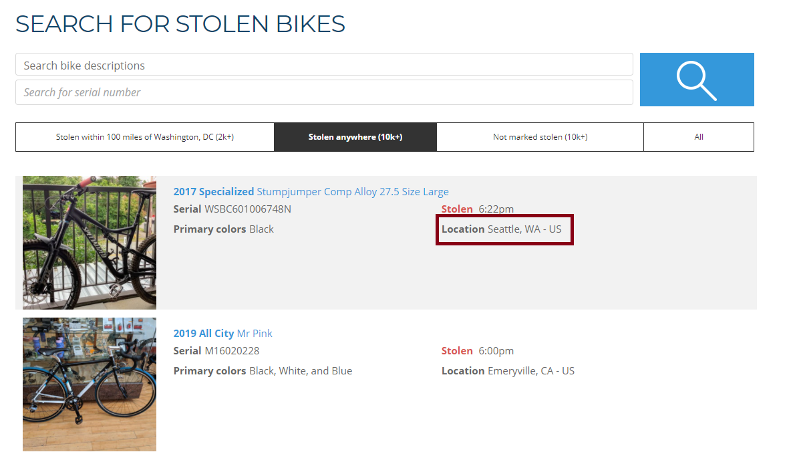
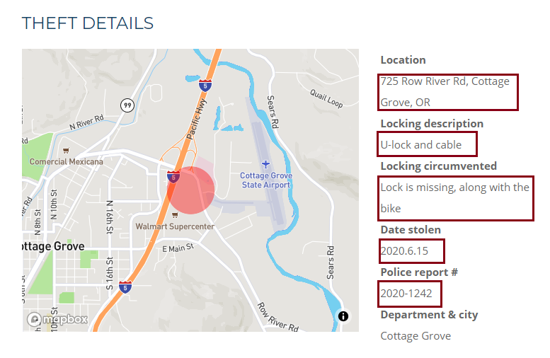

# Stolen Cycles: A Bicycle Theft LocalizationTool 

## DATS 6103 Individual Project 3 : Mariko McDougall


### Statement of Purpose

This is a tool for users to take advantage of the Bike Index to visualize areas of high bike theft. While some "rough" areas can present obvious risks of bike theft, more affluent or tourist-heavy areas can also present a hidden risk to cyclists.  As bicycle thefts tend to be underreported crimes, they also frequently are not reflected in regional crime statistics.

This tool allows users to input their current location, and receive the location and recency of nearby bike thefts. This allows users to make informed decisions prior to leaving their cycle unattended.

This analysis was performed for GWU's DATS 6103 - Introduction to Data Mining. 
The purpose of this analysis is to extract and examine data using publicly available datasets and draw conclusions, as well as make predictions using the findings.

All data sourcing, wrangling and analysis was performed in python using publicly available libraries.


### Data Source

The data for this project was aquired from the Bike Index [https://bikeindex.org/], a nonprofit bike registration orginization that allows users to document their bikes so that in the event they are stolen they are easier to identify and recover.  

An aspect of this service is the ability to mark a pre-registered bike as stolen, making the address and circumstances of the theft available to the public. 

The Bike Index has data provided by cyclists in cities across the United States, and is highly open to developer interaction with the data.

### Search Page

The first portion of the web scraper queries the "Search for Stolen Bikes" page, which contains a complete index of all bikes currently reported stolen throughout the website.



The webscraper interacts with each bicyle entry row in the table on the website, and extract the location stolen, and the hyperlink to the stolen bike's individual page (present in both the image and the name of the bike).   

If the location indicated on the seach page includes the city name, and is in the United States, the webscraper appends the URL to a collection list.

Once all entries on that search page have been parsed, the list is passed on to the second stage of the webscraper for batch processing.


### Individual Bike Pages

On each bike's page, there are photos, model/serial numbers, and identifying features listed which users input at the time of registration. 

We will be using a table added when a registered bike is reported stolen - The Theft Details table.




The Theft Details table is highly malleable, depending on the information a given user inputs.

A full dataset includes **the bike ID, location, a description of the lock (if any), how the lock was circumvented, the date of theft, and if a police report was filed**.   
At minimum, the scraper will extract the ID, location, and date stolen from the table. 

The bike ID is a unique identifier assigned at the time of registration, and is the URL of the bike's page.  

If police report information is captured, the police report number is recorded only as a binary 'Reported'/'Not reported', to preserve privacy.  


[Link](url) and 
```

For more details see [GitHub Flavored Markdown](https://guides.github.com/features/mastering-markdown/).
